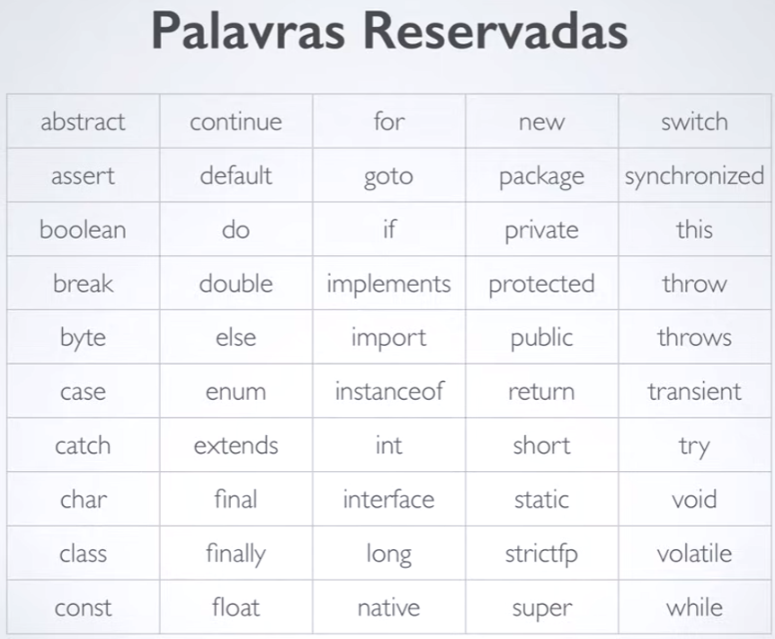

# Introdução a Variáveis

### O que é Variável

É uma referência a um local da memória da máquina para guardar algum valor.

Área da memória associada a um nome, que pode armazenar valores de um determinado tipo. 

Exemplo:

Variável "nomedapessoa" recebe 30 anos.

~~~java
Int nomedapessoa = 30;
~~~

### Sintaxe para declaração de variaveis em JAVA

Para realizar atribuição de um valor a variável: 

Palavras reservadas, que eu não posso utilizar as palavras para dar nome a variáveis. 

Geralmente a primeira letra da variável é minuscula, e o resto segue o padrão, exemplo: int nomeDaPessoa

### Tipos Primitivos

- Inteiro = int
- Numero real = double ou float
- Carácter = char ou string 
