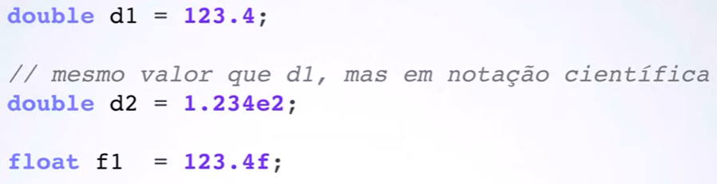
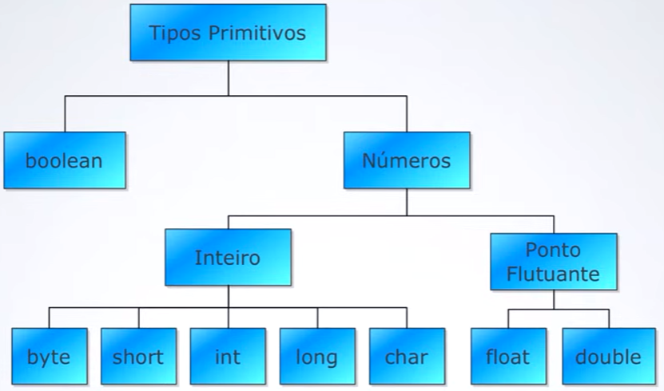
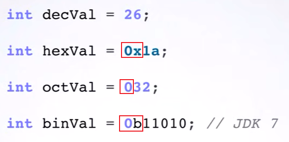
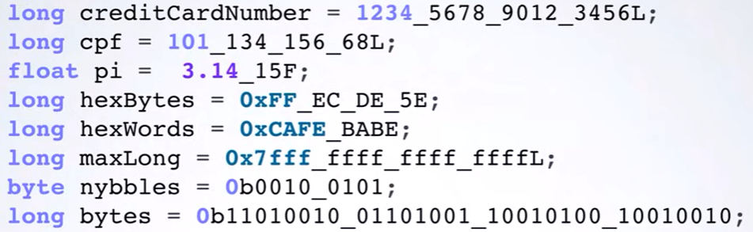
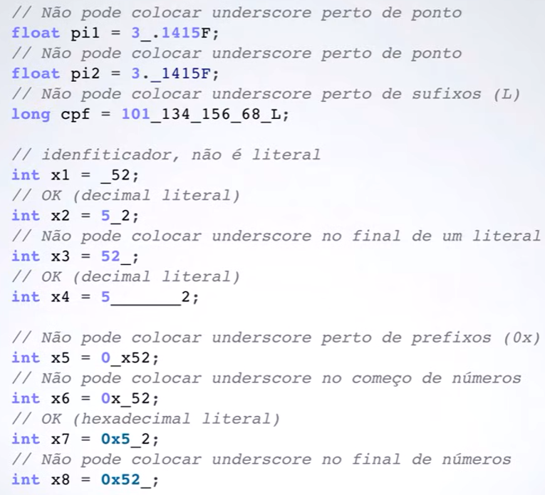
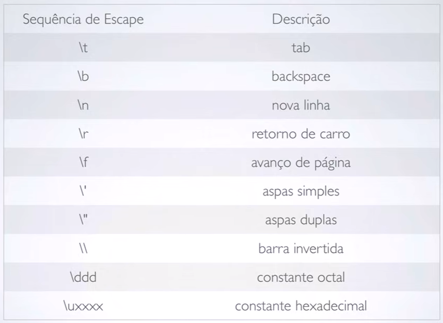

# Variáveis - Tipos Primitivos

### Tipos primitivos
- Tipos Inteiros;
- Tipos Ponto Flutuantes;
- Tipo Char;
- Tipo Boolean;
- Literais.

### Inteiros

São números positivos e negativos. 
Tipos de inteiros: 
- byte
- short
- int
- long
- (char)

| Tipos | Tamanho (bits) |                    Intervalo de Valores                    |       Obs       |
|:-----:|:--------------:|:----------------------------------------------------------:|:---------------:|
| byte  |       8        |                         -128 a 127                         | Menos utilizado |
| short |       16       |                      -32.768 a 32.767                      | Menos Utilizado |
|  int  |       32       |            -2.147.483.648 a <br/>2.147.483.647             | Mais utilizado  |
| long  |       64       | -9.223.372.036.854.775.808 a<br/>9.223.372.036.854.775.807 | Mais utilizado  |

**Declaração:**

| Tipos | Declaração                  |
|:-----:|:----------------------------|
| byte  | ```byte idade1 = 20; ```    |
| short | ```short idade2 = 20; ```   |
|  int  | ```java int idade3 = 20;``` |
| long  | ```long idade4 = 20l;  ```  |

### Ponto Flutuante

São números fracionários, que tem ponto e virgula, casas decimais.
Tipos de Ponto Flutuantes:
- float
- double

| Tipos  | Tamanho (bits) |        Obs        |
|:------:|:--------------:|:-----------------:|
| float  |       32       |  Menos utilizado  |
| double |       64       |  Mais utilizado   |

**Declaração:**

| Tipos  | Declaração                     |
|:------:|:-------------------------------|
| float  | ```float saldo1 = 100.30f; ``` |
| double | ```double saldo2 = 100.30; ``` |

Eles aceitam notação cientifica:


### Char

-pesquisar depois

**Declaração:**

| Tipos | Declaração  |
|:-----:|:------------|
| char  | ```char ``` |
| char  | ```char ``` |

### Boolean
São valores lógicos, verdadeiro e falso. 

**Declaração:**

|  Tipos  | Declaração                       |
|:-------:|:---------------------------------|
| boolean | ```boolean verdadeiro = true ``` |
|  boolean   | ```boolean falso = false ```     |



### Literais

É possível declara no java Hexadecimais, Octais, Binário.



É possível usar o " _ " para melhorar a visualização dos números. 
 

Pode e Não pode: 

### Espace - char

Rotas de escape com char:




