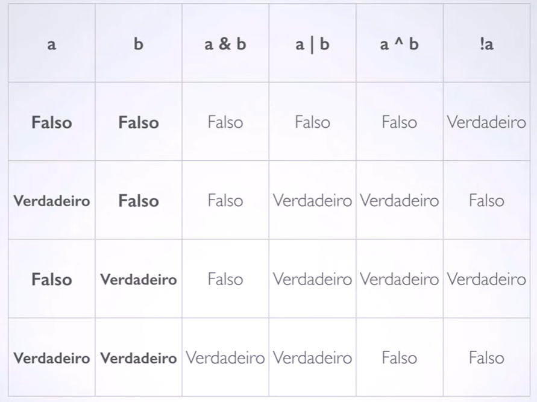
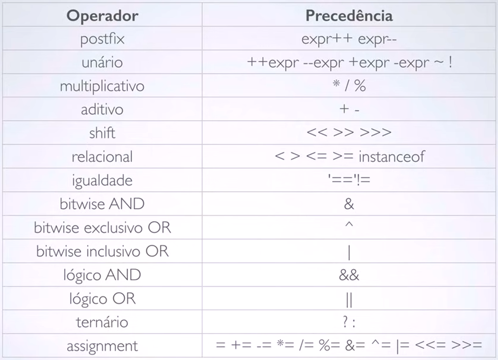

# Operadores (Aritméticos, Lógicos e Relacionais) 

## Operadores Aritméticos

São operadores de soma, subtração, divisão, multiplicação...

| Operador |           Descrição           |
|:--------:|:-----------------------------:|
|    +     |    Adição (e mais unário)     |
|    -     |   Subtração (e mais unário)   |
|    *     |         Multiplicação         |
|    /     |            Divisão            |
|    %     |            Módulo             |
|    ++    |  Incremento (pos ou pré fix)  |
|    --    | Dincremento (pos ou pré fix)  |

Dá para utilizar o + para concatenar strings 

## Operadores Relacionais 

| Operador |      Descrição      |
|:--------:|:-------------------:|
|    ==    |       igual a       |
|    !=    |    diferente de     |
|    >     |      maior que      |
|    <     |      menor que      |
|    >=    | maior ou igual que  |
|    <=    | menor ou igual que  |

## Operadores lógicos

| Operador |     Descrição      |
|:--------:|:------------------:|
|    &     |        AND         |  
|    \     |         OR         |
|    ^     |        XOR         |
|    \\    | OR curto circuito  |
|    &&    | AND curto circuito |
|    !     |        Not         |

O \ representa o |

### Tabela verdade

### Precedência

