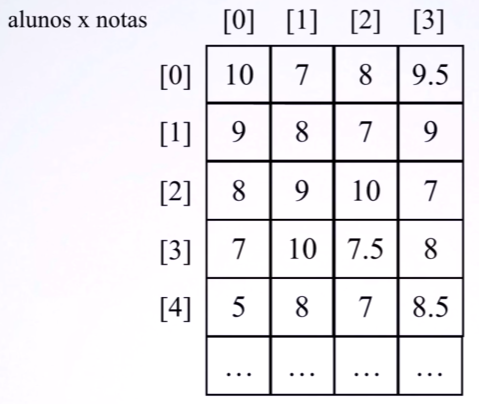
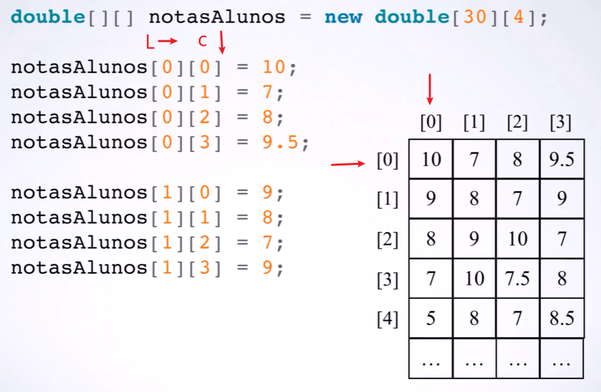
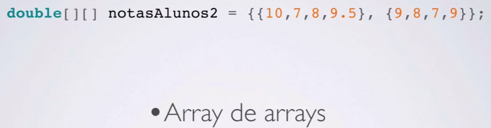
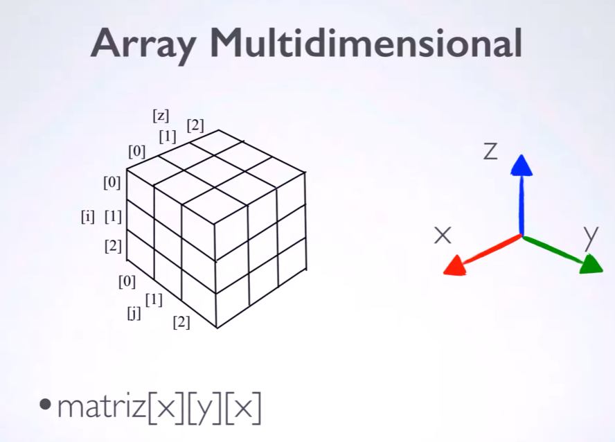

# Matrizes

## Introdução

### Matriz

- Array = lista de n elementos
- Matriz = tabela de n x m elementos 
- Matriz == array de arrays
- 
A matriz é uma tabela:

Na matriz há linha e colunas

### Manupilação 

- setar novos valores, mudar os novos valores e imprimir 

Forma de inicialização: 

### Matriz de 3 dimensões

