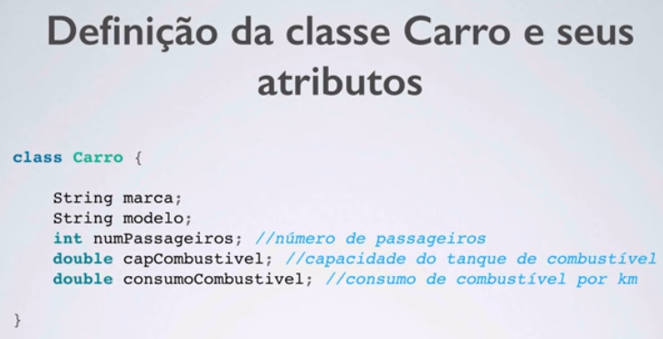

# Orientação a objetos

Atributos são as variáveis

variaveis de instancia;

classe é o declaração do objeto da vida real

qualidades que são chamadas de atributos - variaveis

metodos que são formas de ações 

